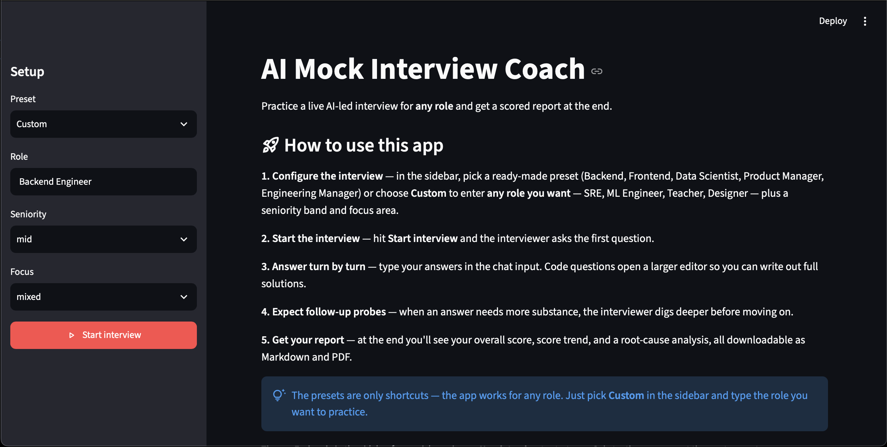
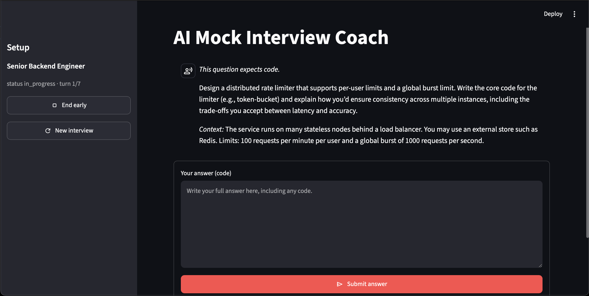

# AI Mock Interview Coach

An AI-first mock-interview prototype that conducts an adaptive 5–7 turn interview, evaluates every candidate response across multiple dimensions, and produces an actionable coaching report.

The project is built as a multi-agent system: specialist agents generate an interviewer persona, ask role-relevant questions, evaluate answers, recover from vague or off-topic responses, and turn the results into clear next steps. A **deterministic orchestrator**—not an LLM—decides how the interview progresses, keeping the flow **inspectable and repeatable**.

Prompt engineering and robustness measures follow the OWASP LLM Prompt Injection Prevention Cheat Sheet, Anthropic's guidance on mitigating jailbreaks and prompt injections, and OpenAI's Structured Outputs guidance. Grading follows OpenAI Evals-style rubric practice to ensure cutting edge guidelines are being followed and implemented to ensure best possible results.

## What it does

The candidate selects a target role, seniority, interview focus, and difficulty. The coach then:

- Runs an interview of 5–7 top-level questions.
- Covers behavioral, technical, case, or mixed interview formats.
- Adjusts difficulty after strong or weak performance.
- Uses targeted probes when an answer is vague, short, off-topic, or an “I don’t know.”
- Scores answers on multiple dimensions rather than giving a binary result.
- Generates a Markdown and PDF coaching report with strengths, patterns, drills, and recommendations for the next session.

## Demo interface

The Streamlit app provides:

- A setup sidebar for role, seniority, focus area, difficulty, and persona presets.
- A chat-style interview experience.
- A larger code-answer editor when a question expects code.
- A final report view with Markdown and PDF downloads.

**Landing page**



**Interview question**



## Architecture overview

### Highlights

- **Deterministic orchestration** — a code-driven orchestrator (not an LLM) keeps **turn count, topic coverage, and probes inspectable and repeatable**, reliably landing in the required **5–7 turns**.
- **Evidence-grounded evaluation** — every dimension score requires a **mandatory quote rationale** that cites the candidate's own words; a deterministic rubric caps and validates the output.
- **Root-cause analysis** — turns raw score signals into **actionable coaching**: recurring patterns resolve to **one targeted drill per candidate**.
- **Prompt-injection defenses** — aligned with the **OWASP LLM Prompt Injection Prevention Cheat Sheet**, Anthropic's jailbreak-mitigation guidance, and OpenAI's Structured Outputs guidance; untrusted content is labelled, bounded, and never placed in system prompts.
- **Evaluator harness with real test coverage** — a labelled, **deterministic eval suite (no LLM-as-judge)** checks score contracts, grounding, response-type accuracy, strong-vs-vague ordering, and injection resilience — coverage the typical baseline project lacks.

### High-level flow


Interactive version: <https://mermaid.ai/d/e1e21dbe-92f3-4247-b239-4660dcc7f25d>

At a high level, each run moves through a small pipeline:

```text
Candidate / Streamlit UI → InterviewSession → Agent layer + deterministic
orchestrator → ConversationState → Report generator → Markdown/PDF output.
```

`app.py` (Streamlit) drives `InterviewSession`, which owns `ConversationState`, calls the five agents, and applies the deterministic orchestrator after every answer; when the interview ends, the report generator exports Markdown and PDF. Everything not captured by that flow is detailed below.

### Agents and responsibilities

| Agent | Responsibility | Output |
| --- | --- | --- |
| Persona Builder | Creates an interviewer persona tailored to the target role, seniority, and focus. | Validated JSON persona with scoring lens, topic areas, and difficulty anchors. |
| Interviewer | Asks the next role-relevant question at the selected difficulty and requested question type. | Validated JSON question. |
| Evaluator | Scores a candidate answer with answer-grounded evidence. | Validated JSON evaluation with five dimension scores, response type, strengths, gaps, and root-cause signal. |
| Prober | Asks a short recovery follow-up after a messy response. | Validated JSON probe, or no probe when recovery is not appropriate. |
| Coach | Converts the deterministic interview summary into a concise candidate-facing debrief. | Markdown narrative with required coaching sections. |

### Orchestration logic

`InterviewSession` is the runtime entry point. It owns the interview state and calls the relevant agent at each step. After every evaluated answer it computes *derived views* — deterministic summaries over raw state, never LLM judgments:

- the current `overall` score and per-dimension score histories;
- `is_messy`, from the last response being classified `vague`, `short`, `off_topic`, or `i_dont_know`;
- `trend()`, comparing the average of the first half of the scores with the second half (`improving` / `declining` / `flat`);
- topic coverage — which required question types are still uncovered;
- the consecutive-probe count and the remaining turn budget.

The deterministic `orchestrator.py` consumes those views in priority order — `end → messy triage → weak+declining → weak → strong → moderate`:

1. **End** the interview after the maximum number of turns, or after a strong finish — which requires at least the minimum turns, **all required topics covered**, a last score at or above the strong threshold, and a non-declining trend.
2. **Messy response triage** — when `is_messy` and a probe is allowed, request a bounded recovery probe at the current escalation stage; otherwise move to a new topic at a lower difficulty (`messy_response_exhausted`).
3. **Weak and declining** — ease off: new topic, difficulty −1.
4. **Weak but stable** — new topic at a lower difficulty.
5. **Strong** — new topic at a higher difficulty.
6. **Moderate** — new topic at the current difficulty.

**Cover all topics first, then probe.** `next_question_type` always picks the least-covered required type, and the mixed-focus plan guarantees at least one behavioral, technical, and case question across the run. Probing is budget-gated by that coverage: a probe is only allowed while the turns still remaining within the maximum are at least the number of uncovered required types. The interview therefore never spends a turn recovering a messy answer if it would leave a required topic uncovered — it covers all required topics first and spends only the remaining turn budget on probes. Escalation is additionally capped at two consecutive probes so the session cannot get stuck on one answer.

Each evaluation also carries a `suspected_root_cause`; the state accumulates these counts across the run so the run-level root cause is resolved deterministically at the end (see [Root-cause analysis](#root-cause-analysis)).

### Interview state and derived views

`ConversationState` (in `state/conversation_state.py`) is pure deterministic state with no LLM calls. Per turn it records the question, each answer, its probe, and its evaluation; globally it keeps per-dimension score histories, overall scores over time, covered question types, root-cause counters, and the consecutive-probe count. From these it derives the views the orchestrator relies on:

- `is_messy` — the last response was classified `vague`, `short`, `off_topic`, or `i_dont_know`.
- `trend()` — `improving` / `declining` / `flat`, from the first-half vs. second-half average of overall scores.
- `uncovered_required()` / `next_question_type()` — which required question types have zero coverage and which to ask next (always the least-covered one, so mixed sessions rotate behavioral, technical, and case).
- `probe_allowed()` — a probe is only permitted while escalation stays under two consecutive probes **and** covering all remaining required topics still fits within the maximum turn budget.

### Root-cause analysis

The evaluator's raw signals are turned into **actionable coaching**: single-answer flags are noisy, so the run-level diagnosis in `analysis/root_cause.py` is deterministic — no LLM calls:

1. **Signature cross-check.** Every candidate pattern (`conflict-avoidance`, `narrative-hoarding`, `insufficient-specificity`, and so on) is matched with a weighted signature over the dimension scores plus a bonus for matching response types. If the best match clears the threshold it is kept; otherwise the answer has no clear cause.
2. **Recurrence gate.** Psychological causes (`status-anxiety`, `fear-of-being-wrong`) are only assigned when the same cause is flagged on at least two answers, so the report never infers a candidate's internal state from a single observation; a lone flag resolves to the observable `insufficient-specificity` label.
3. **Run-level resolution.** The Evaluator's flagged causes are counted across the interview; the most frequent eligible cause wins. When none recur enough, the deterministic signature is applied to the averaged dimension profile and the majority response type.
4. **Drill mapping.** The resolved root cause maps to exactly one targeted drill — a label, a target dimension, an exercise, and a coaching note (for example, "I-claim audit" targets `credibility`, "Restate-before-answer" targets `relevance`). The drill, trend, and dimension averages feed the Coach agent and the report's Summary section, so feedback is a diagnosis rather than generic praise.

### Reporting

The report generator (`utils/report.py`) builds one Markdown source of truth — the transcript with probes and per-dimension scores, the decision log, the root-cause summary with drill, and the Coach's narrative — and renders the PDF from the same Markdown via `fpdf2`, so the two formats cannot diverge. A Methodology section records which model produced each evaluation, whether model fallback was used, and whether every evaluation passed validation.

### Interview sequence

```text
Start → Persona Builder → Interviewer → Candidate Answer → Evaluator →
Deterministic Orchestrator → {Prober | Interviewer | End} → Coach → Report.
```

Scoring details, prompt design, and robustness controls are covered in [Evaluation model](#evaluation-model), [Prompt design](#prompt-design), and [Prompt robustness and reliability](#prompt-robustness-and-reliability).

## Project structure

```text
.
├── app.py                                  # Streamlit UI
├── mock_interview_coach/
│   ├── agents/                              # Persona, interviewer, evaluator, prober, coach
│   ├── analysis/                            # Rubric and root-cause summarisation
│   ├── prompts/                             # One system prompt per agent
│   ├── runtime/interview.py                 # Live interview step machine
│   ├── state/conversation_state.py          # Interview state and coverage/trend logic
│   ├── orchestrator.py                      # Deterministic next-step policy
│   └── utils/                               # LLM client, schemas, parsing, validation, reports
├── scripts/
│   └── run_evals.py                         # API-backed evaluator evaluation harness
├── evals/                                   # Hand-labelled evaluator cases
└── requirements.txt
```

## Setup

### Prerequisites

- Python 3.11 or newer
- A Groq API key

### Install

```bash
git clone <your-repository-url>
cd AI_Mock_Interview_Coach

python -m venv .venv
source .venv/bin/activate
pip install -r requirements.txt
```

Create a `.env` file in the project root:

```env
GROQ_API_KEY=your_groq_api_key
```

Do not commit `.env` or your API key.

### Run the app

```bash
streamlit run app.py
```

In the browser, choose a preset or enter a role, select seniority and focus, and click **Start interview**. Submit answers until the session ends; then download the generated Markdown or PDF report.

### Run evaluator checks

The evaluator harness calls the configured model and therefore requires `GROQ_API_KEY`:

```bash
python scripts/run_evals.py
```

It checks expected product behavior, including strong-versus-vague score ordering, response-type classification, evidence grounding, and resilience to instructions embedded in candidate answers. Reports are written to `evals/reports/`.


## Evaluation model

Each answer is evaluated across five dimensions on a 1–5 integer scale. Scores are rubric-processed and each dimension requires a **mandatory quote rationale** citing evidence from the active candidate answer.

| Dimension | What it measures |
| --- | --- |
| Clarity | Whether the answer is understandable, direct, and well structured. |
| Correctness | Technical or factual soundness relative to the question. |
| Depth | Specificity, reasoning, trade-offs, and meaningful detail. |
| Communication | Ability to explain ideas in a coherent, interview-ready way. |
| Self-awareness | Reflection, ownership, and awareness of limitations or lessons learned. |

The evaluator also classifies the response (`substantive`, `vague`, `short`, `off_topic`, or `i_dont_know`) and identifies a conservative, evidence-based root-cause pattern when appropriate.

## Key design decisions and tradeoffs

### 1. LLM specialists with deterministic control flow

The LLM agents handle language-intensive work—question creation, answer evaluation, probing, and coaching—while application code owns turn limits, coverage, probe limits, difficulty changes, and stop conditions. Because the assignment calls for a 5–7 turn interview, the design deliberately leans toward determinism rather than non-determinism: the number of turns, topic coverage, probe caps, difficulty changes, and stop conditions are all decided by code, not left to an LLM's judgment. This guarantees a session reliably lands inside the required turn range and reproduces the same flow for the same inputs.

**Tradeoff:** this is less free-form than letting one agent plan the entire interview, but it makes behavior easier to test, debug, and explain—and it is what keeps the interview within the required 5–7 turns.

### 2. Structured outputs plus semantic validation

Agents that return data use strict JSON schemas. The application then validates requirements that schema shape alone cannot guarantee, such as requested question type, word limits, allowed probe types, and grounded evaluator rationales. Invalid outputs receive one constrained repair attempt before a safe fallback is used.

**Tradeoff:** validation adds implementation complexity and occasional extra latency, but prevents malformed or workflow-breaking outputs from silently entering state.

### 3. Evidence-grounded, discrete scoring

Evaluator scores are restricted to integers from 1 to 5. Every dimension rationale must quote the candidate answer; deterministic rubric logic applies response-type caps and computes the overall score.

**Tradeoff:** discrete scores can be less nuanced at the margin, but make feedback clearer and scoring behavior more inspectable.

### 4. Prompt-injection-aware trust boundary

Candidate answers, previous model outputs, personas, questions, and transcript data are treated as labelled untrusted data. They are normalized, size-bounded, serialized into user-message JSON, and never interpolated into system prompts. Every agent receives a shared instruction to ignore instructions inside untrusted fields.

**Tradeoff:** this is defense in depth, not a guarantee that prompt injection is impossible. It adds payload-handling code but reduces ambiguity and constrains untrusted context.

### 5. Bounded context and conservative fallbacks

Individual fields and serialized payloads have explicit limits, with visible truncation markers. The system uses safe defaults when a non-critical agent fails; the evaluator avoids model fallback to preserve scoring consistency and returns a clearly marked neutral evaluation if it cannot complete validation.

**Tradeoff:** truncation can omit some context, and fallbacks are intentionally generic, but the interview remains usable rather than failing mid-session.

### 6. Optional grounding was intentionally deferred

The assignment allows web search or RAG, but this prototype does not depend on either. The core objective is a reliable adaptive interview loop; role-aware personas and prompts are sufficient for the proof of concept.

**Tradeoff:** this keeps the prototype smaller and easier to run, at the cost of not incorporating live role-specific trends or company materials.

## How this compares to a minimal mock-interview baseline

A minimal multi-agent baseline wires interviewer, evaluator, and coach prompts to an orchestrator and stops there. This prototype goes further in four ways:

- **Prompt engineering.** Five agents each own a dedicated, static system prompt under `mock_interview_coach/prompts/`. Dynamic content is serialized into labelled JSON in user messages under a shared trust boundary; untrusted text is normalized, size-bounded, and never interpolated into system prompts. The evaluator's rationale must quote evidence from the active answer, so scoring is grounded rather than asserted.
- **Robustness.** Strict JSON schemas are only the shape layer. Deterministic application code then validates workflow invariants—question type, word limits, probe types, evidence grounding—applies one constrained repair attempt, and falls back safely, keeping malformed or workflow-breaking output out of state.
- **Coaching depth.** A deterministic root-cause analysis cross-checks the evaluator's signal against dimension-score signatures and maps recurring patterns to one targeted drill per candidate (e.g. "I-claim audit", "Restate-before-answer"), turning feedback into diagnosis rather than generic praise.
- **Security and evaluation.** Prompt-injection defenses follow the OWASP LLM Prompt Injection Prevention Cheat Sheet, Anthropic's guidance on mitigating jailbreaks and prompt injections, and OpenAI's Structured Outputs guidance. Grading follows OpenAI Evals-style rubric practice: discrete evidence-grounded scores with deterministic response-type caps.
- **Evaluator harness.** The baseline ships no eval harness or score-regression checks. This project ships a labelled, deterministic evaluator suite (`scripts/run_evals.py`) that checks score contracts, evidence grounding, response-type accuracy, strong-vs-vague ordering, and injection resilience across models.

## Example interview transcripts


| Archetype | Transcript | What it demonstrates |
| --- | --- | --- |
| Strong candidate | `transcripts/strong.md` | Difficulty increases after strong performance; answers with specific evidence and measurable impact. |
| Weak candidate | `transcripts/weak.md` | Difficulty eases; the report recommends a repeatable diagnostic framework. |
| Tricky / edge case | `transcripts/tricky.md` | Recovery probes after messy responses; resistance to instructions embedded in answers. |

## Prompt design

Each agent has a separate prompt under [`mock_interview_coach/prompts/`](/Users/krishnakoundinyachemboli/Desktop/projectsVSC/AI_Mock_Interview_Coach/mock_interview_coach/prompts). This keeps responsibilities isolated and makes prompt iteration reviewable. Dynamic input is supplied as labelled JSON in a user message; system prompts remain static.

## Prompt robustness and reliability

Every agent prompt ships curated few-shot exemplars so outputs are calibrated before a model ever sees a live session: the interviewer prompt carries question examples for each seniority band and question type — including classic LeetCode-style algorithmic questions such as merging two sorted arrays, a fixed-window rate limiter, and constant-space duplicate detection — the persona builder carries exemplar personas per band, the evaluator carries scoring-calibration pairs, and the prober and coach carry output-shape examples. Because the Persona Builder synthesizes a fresh interviewer persona from the target role, seniority, focus, and difficulty at session start, the coach is not limited to preset profiles — it adapts to virtually any role.

The trust boundary aligns explicitly with the **OWASP LLM Prompt Injection Prevention Cheat Sheet**, Anthropic's guidance on mitigating jailbreaks and prompt injections, and OpenAI's Structured Outputs guidance.

Beyond the trust-boundary design above, a set of concrete mechanisms keeps the prompts robust and the pipeline reliable:

| Mechanism | Protects against / guarantees |
| --- | --- |
| Grounded-quote validation (`agents/evaluator.py`) | Hallucinated score rationales — every rationale must quote the candidate answer |
| Input normalization strips control, bidi-override, and zero-width chars (`agents/_common.py`) | Injection payloads hidden in invisible characters |
| Shared word budgets read by both prompt and validator (`agents/_common.py`) | Prompt/validator drift; runaway question, probe, or coach length |
| Adaptive payload compaction to a 12,000-char ceiling (`agents/_common.py`) | Context overflow on long sessions |
| One constrained repair + hinted LLM retry + `on_error` safe fallback (`make_agent`) | Malformed output or transient LLM failure crashing the loop; outputs stamped `validated` |
| Larger code-answer budget (2,000 → 6,000 chars) | Full solutions truncated before scoring |
| Retry with backoff + jitter, `Retry-After` honored, 60 s ceiling (`utils/llm.py`) | Rate limits and timeouts aborting calls |
| Empty completion treated as a retryable failure (`utils/llm.py`) | Blank output silently passing as valid |
| Automatic fallback model on 429s; `reasoning_format="hidden"` (`utils/llm.py`) | Downtime; model reasoning leaking into outputs |
| Evaluator `temperature=0` with no model fallback | Scoring consistency across the run |
| Provenance call log + report Methodology section | Auditability of which model produced each evaluation |
| Evaluator eval harness (`scripts/run_evals.py`, `evals/`) | Model regressions in scoring — a labelled case suite with deterministic assertions (no LLM-as-judge) checks score contracts, response-type accuracy, evidence grounding, strong-vs-vague ordering, and injection resilience, with per-model Markdown/JSON reports |

The eval harness accepts repeated `--model` flags to compare models side by side and records unavailable calls as safe neutral fallbacks rather than quality judgments.

## Future improvements

- Add an optional RAG source for role- or company-specific interview material.
- Save past sessions and show progress across multiple interviews.
- Add a human-review workflow for evaluator calibration data.
- Surface score trends and dimension charts in the UI.
- Add integration tests against a mock LLM provider and CI for API-backed evaluations.

## Assignment checklist

| Assignment requirement | Where it is addressed |
| --- | --- |
| At least three distinct agents | Five focused agents: Persona Builder, Interviewer, Evaluator, Prober, and Coach. |
| Intelligent, adaptive 5–7 turn interview | `InterviewSession`, deterministic orchestrator, difficulty changes, and capped probes. |
| Multi-dimensional evaluation | Five-dimension, evidence-grounded 1–5 evaluator rubric. |
| Structured coaching feedback | Markdown/PDF report with strengths, gaps, drills, and next-session actions. |
| Simple interface | Streamlit app in `app.py`. |
| Modular source, requirements, and separate prompts | Project structure above; prompts live in `mock_interview_coach/prompts/`. |
| Setup and run instructions | [Setup](#setup). |
| Architecture and orchestration overview | [Architecture overview](#architecture-overview). |
| Design decisions and tradeoffs | [Key design decisions and tradeoffs](#key-design-decisions-and-tradeoffs). |
| Strong, weak, and edge-case transcripts | [Example interview transcripts](#example-interview-transcripts). |
